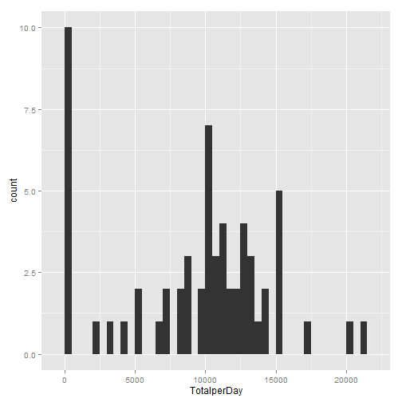
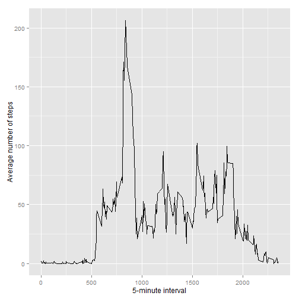
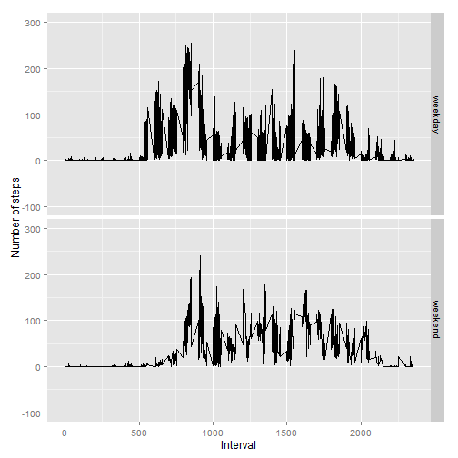

## Loading and preprocessing the data


```r
library(dplyr)
# Set your working directory to where the 'activity.csv' file is located.
Activity <- read.csv("activity.csv")
Activity <- mutate(Activity, Weekday = weekdays(as.POSIXlt(Activity$date)), date = strftime(Activity$date, "%m-%d-%y"))
```


## What is mean total number of steps taken per day?


```r
library(ggplot2)
TotalStepPerDay <- group_by(Activity,date) %>% 
        summarize(TotalperDay = sum(steps, na.rm = TRUE))

qplot(TotalperDay, data = TotalStepPerDay,binwidth = 500)
```

 

```r
mean(TotalStepPerDay$TotalperDay)
```

```
## [1] 9354.23
```

```r
median(TotalStepPerDay$TotalperDay)
```

```
## [1] 10395
```


## What is the average daily activity pattern?


```r
#The average number of steps taken, averaged across all days of the 5-minute interval 
AveDailyInterval <- group_by(Activity,interval) %>% 
        summarize(AveSteps = mean(steps, na.rm = TRUE))

g <- ggplot(AveDailyInterval,  aes(interval,AveSteps))
g + geom_line() + labs(x = "5-minute interval") +
        labs(y = "Average number of steps")
```

 

## Imputing missing values


```r
#The total number of missing values in the dataset (i.e. the total number of rows with NAs)
sum(rowSums(is.na(Activity)))
```

```
## [1] 2304
```

```r
#Compute the mean for each day
MeanPerDay <- group_by(Activity,date) %>% 
        summarize(TotalMeanDay = mean(steps, na.rm = TRUE))

#Where no steps are recorded in a day, insert zero(0) for mean
MeanPerDay[is.nan(MeanPerDay$TotalMeanDay),2] = 0

#All of the missing values in the dataset are filled in using the mean for each day
#And a new dataset is created that is equal to the original dataset but with the missing data filled in.
for(i in seq_along(MeanPerDay$TotalMeanDay)){
        Activity[Activity$date == MeanPerDay[[i,1]] & is.na(Activity$steps),1] = MeanPerDay[[i,2]]
}

TotalStepPerDay <- group_by(Activity,date) %>% 
        summarize(TotalperDay = sum(steps))

qplot(TotalperDay, data = TotalStepPerDay,binwidth = 500)
```

 

```r
mean(TotalStepPerDay$TotalperDay)
```

```
## [1] 9354.23
```

```r
median(TotalStepPerDay$TotalperDay)
```

```
## [1] 10395
```

## Are there differences in activity patterns between weekdays and weekends?


```r
Activity <- mutate(Activity, WeekType = factor(Weekday %in% c("Sunday","Saturday"), labels = c("weekday","weekend")))

#Averaged across all weekday days and weekend days of the 5-minute interval
AveStepInterval <- group_by(Activity, WeekType,Weekday,interval) %>%
        summarize(AverageSteps = mean(steps))

g <- ggplot(AveStepInterval,  aes(interval,AverageSteps))
g + geom_line() + facet_grid(WeekType ~ .) +
        labs(x = "Interval") +
        labs(y = "Number of steps") +
        ylim(-100, 300)
```

 
